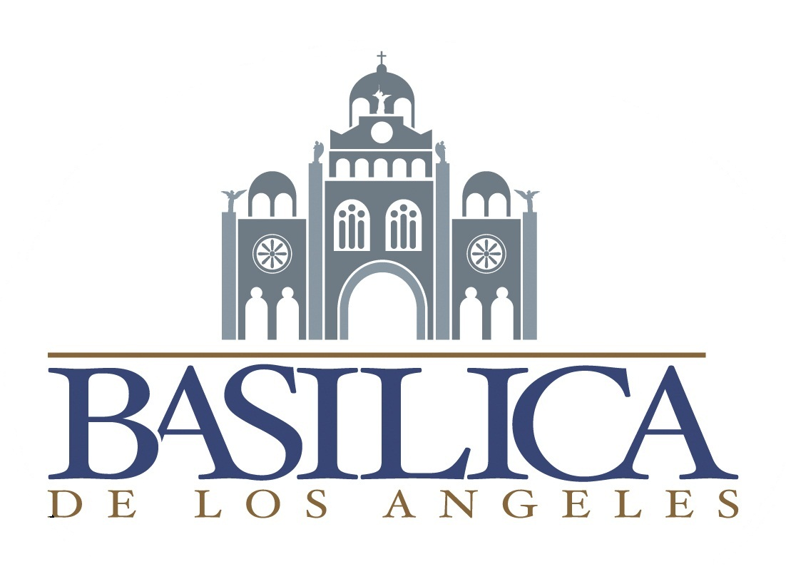

<p align="center">
  
</p>

<h1 align="center">🏛️ Web-Site-TCU</h1>
<h3 align="center">Basílica de Nuestra Señora de los Ángeles</h3>

<p align="center">
  <a href="https://basilicadelosangeles.cr" target="_blank"><strong>🌐 Ver sitio en producción</strong></a>
</p>

<p align="center">
  
  
  
  
</p>

<p align="center">
  
  
  
</p>

---

## 📖 Descripción

Sitio web moderno y de alto rendimiento para la **Basílica de Nuestra Señora de los Ángeles** (Cartago, Costa Rica), desarrollado como parte de un **TCU (Trabajo Comunal Universitario)**.

Presenta contenido clave para visitantes y peregrinos: historia, arquitectura, horarios, ubicación, noticias y donaciones, con una estructura pensada para **SEO**, **rendimiento** y **accesibilidad**.

---

## 🎯 Objetivos / Entregables

| Objetivo | Estado |
|----------|:------:|
| Sitio informativo con secciones esenciales | ✅ |
| Experiencia **responsiva** (móvil, tablet, escritorio) | ✅ |
| Prácticas de **accesibilidad** (WCAG 2.1) | ✅ |
| SEO (metadatos, canonical, Open Graph, JSON-LD) | ✅ |
| Pruebas automatizadas con Vitest | ✅ |

---

## 🗂️ Alcance

### ✅ Incluye

<details>
<summary><strong>📄 Páginas públicas</strong></summary>

- 🏠 Inicio
- 🏛️ Arquitectura
- 🕐 Horarios
- 📍 Ubicación
- 🚶 Peregrinación
- 👼 Virgen de los Ángeles
- 🖼️ Galería
- 📰 Noticias
- ✉️ Contacto
- 💝 Donar

</details>

<details>
<summary><strong>🔧 Funcionalidades</strong></summary>

- Layout común con navegación y pie de página
- SEO completo (`<title>`, meta description, canonical, Open Graph, Twitter cards, JSON-LD)
- Sitemap automático
- Sistema de íconos
- Chatbot UI flotante (placeholder)
- Accesibilidad y responsividad multi-dispositivo

</details>


## ✨ Lo logrado

- ✅ Sitio funcional con rutas en `src/pages/`
- ✅ Diseño consistente con Tailwind (enfoque **mobile-first**)
- ✅ Experiencia **responsiva** para distintos tamaños de pantalla
- ✅ **Accesibilidad**: enlace para saltar al contenido, estados de foco visibles
- ✅ SEO y datos estructurados (Schema.org)
- ✅ Suite de pruebas con **Vitest**:
  - Validaciones de formatos (donaciones, páginas)
  - Sanitización y seguridad (XSS/SQLi)

---

## 🛠️ Tecnologías

<table>
  <tr>
    <td align="center"><strong>Frontend</strong></td>
    <td align="center"><strong>SEO</strong></td>
    <td align="center"><strong>Calidad</strong></td>
    <td align="center"><strong>Plataforma</strong></td>
  </tr>
  <tr>
    <td>
      <br/>
      <br/>
      
    </td>
    <td>
      <code>@astrojs/sitemap</code><br/>
      Open Graph<br/>
      Schema.org JSON-LD
    </td>
    <td>
      <br/>
      
    </td>
    <td>
      <br/>
      
    </td>
  </tr>
</table>

---

## 📁 Estructura del proyecto

```
📦 Web-Site-TCU
├── 📂 public/          # Archivos estáticos (imágenes, robots.txt)
├── 📂 src/
│   ├── 📂 components/  # Navbar, Footer, Chatbot, íconos
│   ├── 📂 layouts/     # Layouts compartidos
│   ├── 📂 pages/       # Rutas del sitio
│   ├── 📂 styles/      # Estilos globales
│   └── 📂 utils/       # Validadores / sanitización
├── 📂 tests/           # Pruebas unitarias
├── 📄 astro.config.mjs
├── 📄 tailwind.config.cjs
├── 📄 package.json
└── 📄 README.md
```

---

## 🚀 Instalación y uso

### 1️⃣ Instalar dependencias

```bash
npm install
```

### 2️⃣ Desarrollo local

```bash
npm run dev
```

### 3️⃣ Build y preview

```bash
npm run build
npm run preview
```

---

## 📜 Scripts disponibles

| Comando | Descripción |
|---------|-------------|
| `npm run dev` | Servidor de desarrollo |
| `npm run build` | Build de producción |
| `npm run preview` | Previsualización del build |
| `npm run lint` | Lint del código en `src/` |
| `npm test` | Ejecutar pruebas |
| `npm run test:watch` | Pruebas en modo watch |
| `npm run test:coverage` | Reporte de cobertura |

---

## 🧪 Pruebas

```bash
npm test
```

### Suites incluidas

| Suite | Descripción |
|-------|-------------|
| `pages.test.js` | Estructura y formatos de páginas |
| `donation.test.js` | Validación de IBAN, SINPE, URLs |
| `validators.test.js` | Validadores y sanitización |
| `security.test.js` | Detección XSS/SQLi (OWASP) |

### Cobertura

```bash
npm run test:coverage
```

---

## 👥 Contribuyentes

<table>
  <tr>
    <td align="center">
      <a href="https://github.com/javier25arroyo">
        <br />
        <sub><b>Javier Arroyo Rojas</b></sub>
      </a>
    </td>
    <td align="center">
      <a href="https://github.com/lotusmz">
        <br />
        <sub><b>Mary Paz Araya</b></sub>
      </a>
    </td>
    <td align="center">
      <a href="https://github.com/Gabo2403">
        <br />
        <sub><b>Gabriel Guzmán Leiva</b></sub>
      </a>
    </td>
  </tr>
</table>


---

## 📄 Licencia

Este proyecto está bajo la licencia **MIT**. Consulta el archivo [LICENSE](LICENSE) para más detalles.

```
MIT License - Copyright (c) 2025 Basílica de Nuestra Señora de los Ángeles - TCU
```

---

<p align="center">
  Hecho con ❤️ para la comunidad costarricense
</p>
